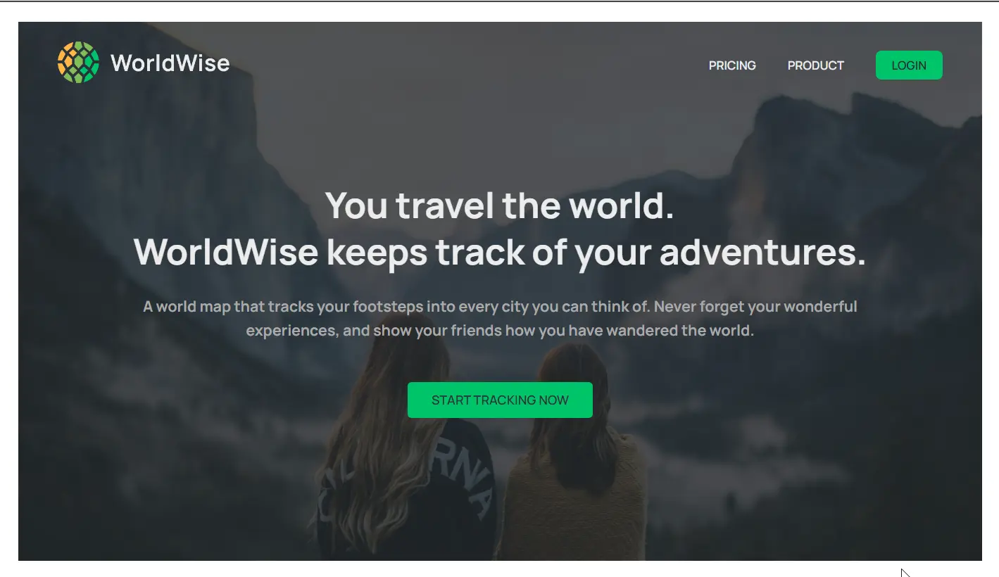

### 👋 **I am Erhan ERTEM**

&emsp;

## Udemy The Ultimate React Course 2024: React, Redux & More by Jonas Schmedtmann

### **Objective:** Create WorldWise App

- SPAs & React Routing via react-router-dom package
  - Creating, nesting, index(default) routes
  - Declarative Navigation
    - Link, NavLink RRC components
  - Programmatic Navigation
    - Declarative Programmatic Navigation
      - Navigate RRC component
    - Imperative Programmatic Navigation
      - useNavigate() RRC hook
  - Low level login/logout functionality
    - Protected route implementation
  - useEffect and inside-function memoization via useCallback hook
- CSS handling in this app
  - CSS-modules
- Code splitting for bundled file optimization
  - Route lazy loading via lazy hook
  - Provide fallback loader component via Suspense wrapper component @ routes

Aside from curriculum:

- Establish a backend to host json-server with CORs
- Add conditional Login/Logoff Button @ landing page based on isAuthenticated state when in Protected Route and used
  Browser back navigation button

&emsp;

###### ⚠️Free-tier render services may experience throttling, leading to delayed app loading times. Since the API and client are hosted separately, getting the backend online may take additional time to respond due to enforced spin-downs on free-tier services.

#### [WorldWise App](https://app-worldwise-erhan-ertem.onrender.com/)

---

